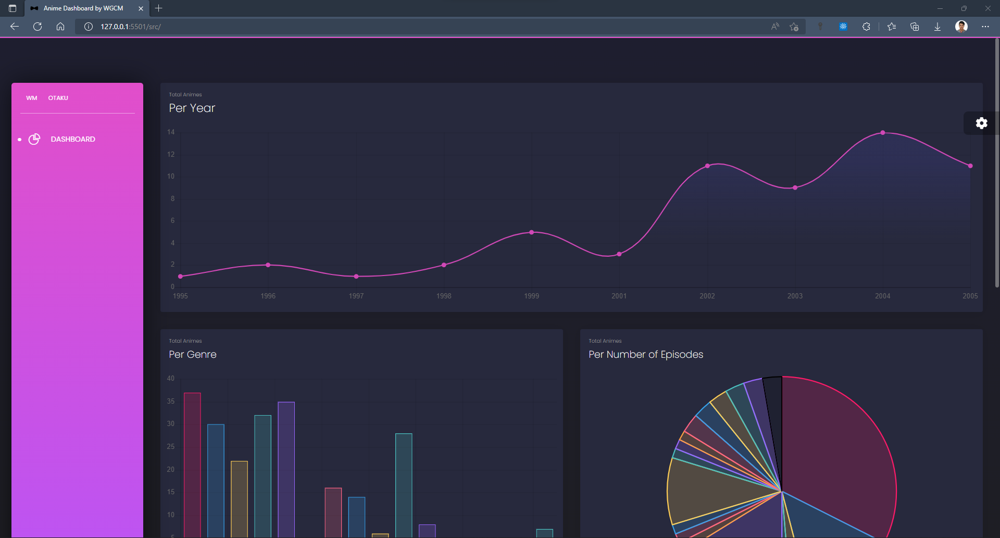
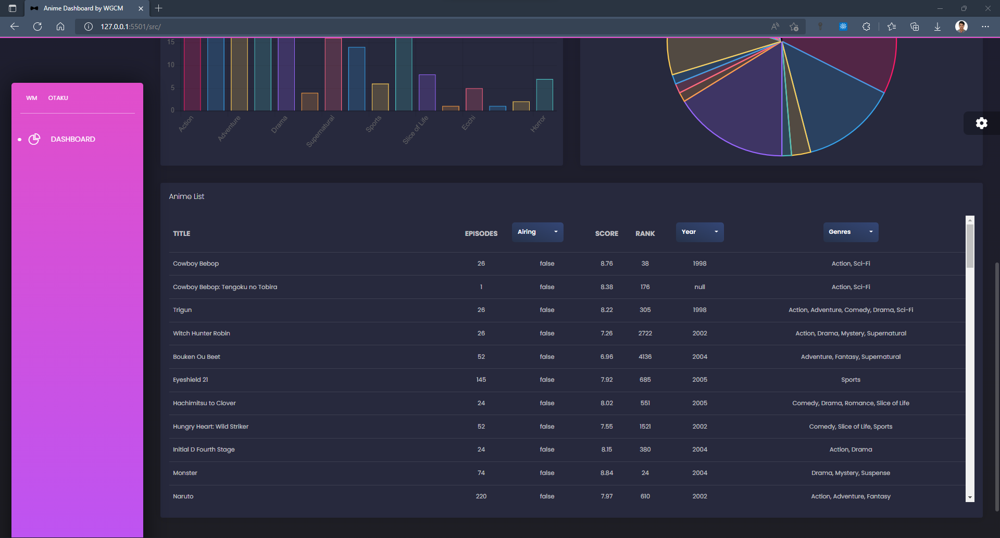

# Proyecto 2

Diseñar e implementar una página web interactiva y adaptable que utilice las tecnologías disponibles del lado del cliente.

### Link a la pagina web resultante:

[Anime Dashboard](https://wgcotera.github.io/proyectos-dawm/proyecto-02/src/)

### Graficas con de datos cargados directamente de la API.

### Tabla con filtros de busqueda

## Lineamientos

Debe realizar una página web con un dashboard. Algunas consideraciones serán revisadas en su página web:

- Utilice un marco de trabajo (framework) para la maquetación del sitio .
- Se recomienda utilizar una plantilla gratuita de Material Design for Bootstrap (Enlaces a un sitio externo.), de ThemeWagon (Enlaces a un sitio externo.) o de cualquier otro sitio.
- Use alguna librería css para efectos.
- Incorpore gráficos (charts) con alguna librería, como ChartCSS (Enlaces a un sitio externo.), D3JS (Enlaces a un sitio externo.) o los charts de MDB (Enlaces a un sitio externo.).
- Uso de una fuente de datos externos
- Consuma un API público, gratuito, sin autenticación (de preferencia) y que permita requerimientos cruzados, cuyo resultado sea un JSON o un XML.
- Provea de un mecanismo para filtrar los datos que se muestran en el dashboard, por ejemplo:
  - El usuario selecciona un valor de una lista desplegable.
  - Automáticamente, con el valor seleccionado en la lista desplegable, se filtrarán los datos que se encuentran en una tabla, panel o gráfico.
  - Los valores de la lista como los de la tabla, panel o gráfico son cargados dinámicamente a partir de la fuente de datos externa.

## Instrucciones

- Desde la línea de comandos, en la raíz de la carpeta del proyecto
  - Ingrese a la carpeta con el ejercicio
  - Instale los paquetes necesarios, con: `npm install`

## Referencias

- https://github.com/creativetimofficial/black-dashboard
